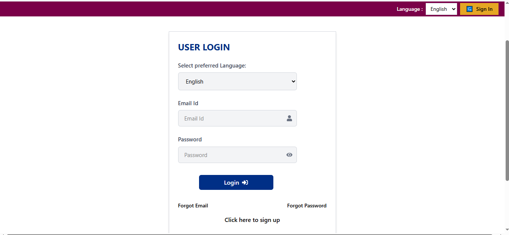
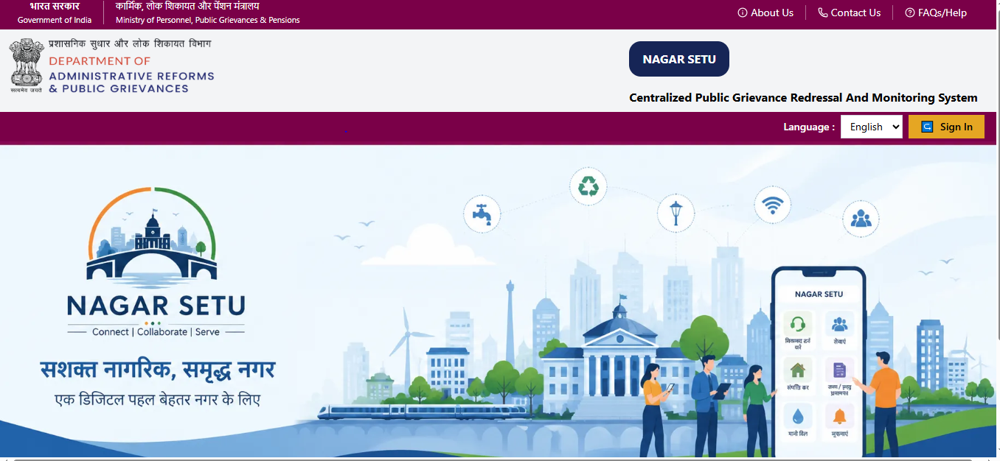
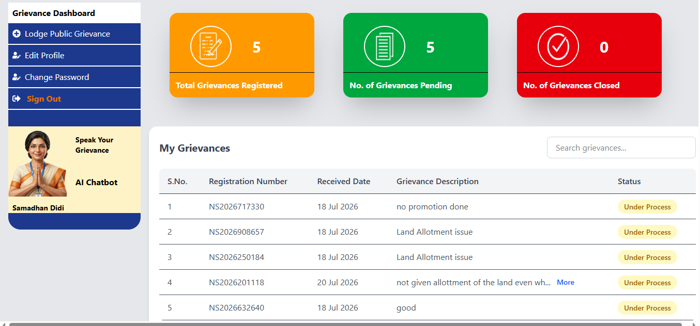
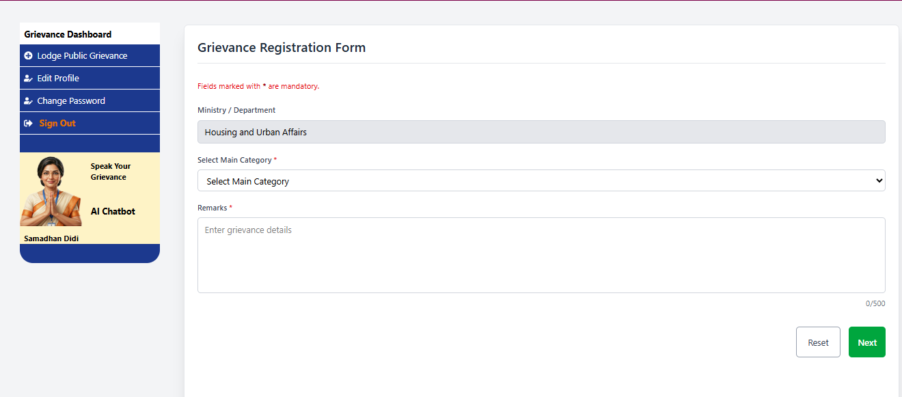
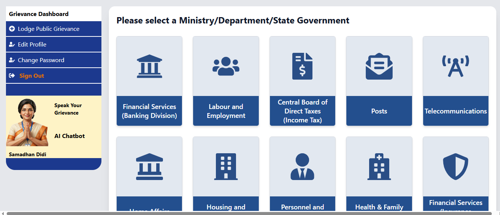

Nagar Setu is a web app developed by Pulkit Acharya , it is one of  my personal projects . The idea is to develop an e-governance style portal where users can lodge a grievance to the government . Example -  Water supply leakage problem , lack of mobile toilet facility etc.

NOTE : This is my personal project . This web app is not affiliated with any government organization.
The frontend of the app is developed on React JS and Tailwind CSS and Firebase serves as the backend.
The users will be available to lodge a complaint ,  view the  "Total Lodged Complaints" , "Closed Complaints" and "Pending Complaints" on the dashboard . Furthermore , the lodged grievances will be displayed in the form of a table  where all the information of the LODGED grievances will be displayed having columns --> S.No. , Registration No. , Received Date , Grievance Description (with a popup menu (More) only if the grievance remarks exceeds 40 characters) and Status of the grievance (whether under process or closed).

############## TECH STACK ################
- React.js
- Vite
- Tailwind CSS
- Firebase Authentication
- Firestore
- React Hook Form
- TanStack React Table

############SCREENSHOTS OF NAGAR SETU #######################
# Login Screen

# Home Screen

# User Dashboard Screen

# Grievance Registration Form Screen

# Select Ministry or Department Screen

